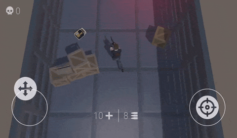

# Atomic Zombie Shooter

This is a small sample of a zombie shooter game, created based on an Atomic Framework.

### What is Atomic Framework?
Atomic Framework is a solution designed for developing games in C# and Unity. The main idea of framework is reduce code complexity by separating state and behaviour of game code. To achieve the flexibility and reusability of game mechanics, it is necessary to look towards procedural and reactive programming instead of OOP.

### Sample description

Sample of the game is based on the principle of modularity. Independent modules are located in the `Assets/Modules` folder, while the game's integration code is in the `Assets/Game/Scripts` folder.

The following mechanics have been implemented:
- Character movement;
- Shooting a pistol at zombie enemies;
- Health and weapon magazine;
- Picking up medkits and ammunition;
- Basic AI for zombie enemies (player pursuit and attack)

Dependencies:
- [Atomic Framework](https://github.com/StarKRE22/Atomic) (free)
- UniTask (free)
- Dotween (free)
- Odin Inspector / Validator (paid)

